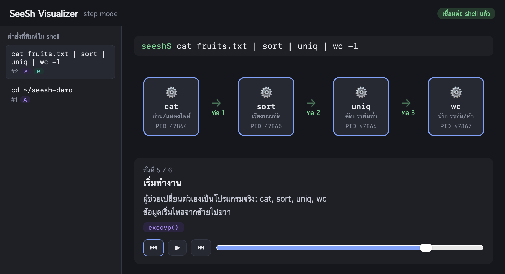
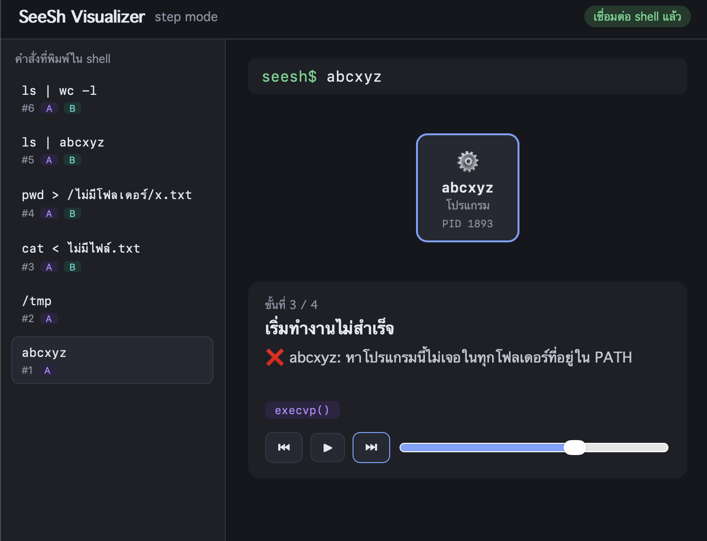
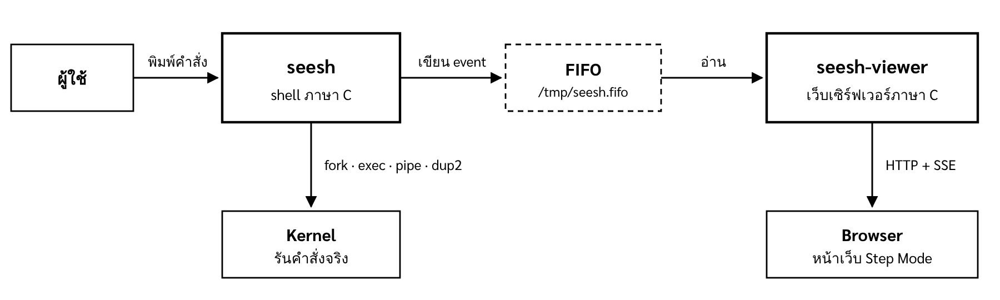

# SeeSh: See-Through Shell for Visualizing System Calls

**SeeSh** เป็น shell ที่เขียนขึ้นเองด้วยภาษา C โดยใช้ POSIX system call จริง ใช้งานได้เหมือน shell ทั่วไป และทุกครั้งที่รันคำสั่ง SeeSh จะส่งข้อมูลว่าตัวเองเรียก system call อะไรบ้างไปแสดงบนหน้าเว็บ ซึ่งอธิบายการทำงานทีละขั้นเป็นภาษาไทย

ปกติเวลาพิมพ์คำสั่งอย่าง `ls | wc -l` เราเห็นแค่ผลลัพธ์ แต่มองไม่เห็นว่าระบบปฏิบัติการสร้าง process ต่อท่อ และรอให้โปรแกรมทำงานเสร็จอย่างไร SeeSh ทำให้ขั้นตอนเหล่านี้มองเห็นได้ โดยทุกอย่างที่แสดงมาจากการทำงานจริง ไม่ใช่การจำลอง



รายวิชา Operating Systems and System Calls Programming · Mini Project · มหาวิทยาลัยขอนแก่น

## สารบัญ

1. [สมาชิก](#สมาชิก)
2. [ความสามารถ](#ความสามารถ)
3. [การทำงานของระบบ](#การทำงานของระบบ)
4. [สิ่งที่ต้องติดตั้ง](#สิ่งที่ต้องติดตั้ง)
5. [ดาวน์โหลดและคอมไพล์](#ดาวน์โหลดและคอมไพล์)
6. [วิธีรัน](#วิธีรัน)
7. [วิธีใช้หน้าเว็บ](#วิธีใช้หน้าเว็บ)
8. [คำสั่งตัวอย่าง](#คำสั่งตัวอย่าง)
9. [การทดสอบ](#การทดสอบ)
10. [แก้ปัญหาที่พบบ่อย](#แก้ปัญหาที่พบบ่อย)
11. [โครงสร้างโปรเจกต์](#โครงสร้างโปรเจกต์)
12. [เอกสารเพิ่มเติม](#เอกสารเพิ่มเติม)

## สมาชิก

| ชื่อ | รหัสนักศึกษา |
|---|---|
| นายอาณัฐ อารีย์ | 673380432-5 |
| นายพัทธดนย์ คำนัน | 673380416-3 |
| นายณัฐภัทร ฉ่ำตะคุ | 673380583-4 |

## ความสามารถ

### ตัว shell

| ความสามารถ | ตัวอย่าง |
|---|---|
| รันโปรแกรมทุกตัวที่อยู่ใน `PATH` | `ls -l`, `echo hello`, `ps` |
| Built-in 6 คำสั่ง | `cd`, `pwd`, `jobs`, `history`, `help`, `exit` |
| Redirection ทั้งกับโปรแกรมภายนอกและ built-in | `sort < in.txt`, `ls > out.txt`, `pwd >> log.txt` |
| Pipe หลายขั้น และใช้ร่วมกับ redirection | `cat < in.txt \| sort \| uniq > out.txt` |
| งานเบื้องหลัง เมื่อเสร็จแจ้ง Done และไม่มี zombie | `sleep 5 &` |
| Ctrl+C หยุดเฉพาะโปรแกรมที่รันอยู่ shell ไม่ปิด | `sleep 30` แล้วกด Ctrl+C |
| ข้อความในเครื่องหมายคำพูดเป็นคำเดียว | `echo "Hello   OS"` |
| แจ้งข้อผิดพลาดและ exit status แบบเดียวกับ bash | หาโปรแกรมไม่เจอ = 127, รันไม่ได้ = 126 |

### หน้าเว็บ Step Mode

- แสดงทุกคำสั่งที่พิมพ์แบบ real-time
- วาดกล่อง process ท่อ และไฟล์ พร้อม PID จริง
- เล่าการทำงานทีละขั้นเป็นภาษาไทย แต่ละขั้นมีชื่อ system call กำกับ
- บอกได้ว่าคำสั่งที่ผิดพลาดล้มที่ขั้นไหนและเพราะอะไร



### สิ่งที่ไม่รองรับ

- Scripting (`if`, `for`), ตัวแปร (`$HOME`), wildcard (`*.c`) และ `~`
- `;`, `&&`, `||`
- `fg`, `bg`, Ctrl+Z, `!!` และ pipe ที่ทำงานเบื้องหลัง (`ls | wc &`)
- ใช้ built-in ใน pipe (`history | grep ls`)
- ปุ่มลูกศรเรียกคำสั่งเก่าและ auto-complete

## การทำงานของระบบ



ระบบมี 3 ส่วนที่แยกกัน

1. **`seesh`** คือตัว shell รับคำสั่งจากผู้ใช้และรันจริงผ่าน kernel ระหว่างรันจะเขียนข้อมูลของแต่ละขั้น (เรียกว่า event) เป็น JSON ลงใน FIFO ที่ `/tmp/seesh.fifo`
2. **`seesh-viewer`** คือเว็บเซิร์ฟเวอร์ภาษา C อ่าน event จาก FIFO แล้วส่งต่อให้ browser ทันทีด้วย Server-Sent Events
3. **หน้าเว็บ** นำ event มาวาดเป็นภาพและคำอธิบายทีละขั้น

shell ไม่ต้องรอหน้าเว็บ ถ้าไม่ได้เปิดหน้าเว็บหรือปิดไปกลางคัน shell ก็ยังใช้งานได้ปกติ

ตัวอย่างสิ่งที่เกิดขึ้นเบื้องหลังคำสั่ง `ls | wc -l`

```
shell    pipe()              สร้างท่อ: fd[3] = ปลายอ่าน, fd[4] = ปลายเขียน
shell    fork()              สร้างลูก A
  ลูก A  dup2(4, STDOUT)     ให้ทางออกของ ls ลงท่อ
  ลูก A  execvp("ls")
shell    fork()              สร้างลูก B
  ลูก B  dup2(3, STDIN)      ให้ wc อ่านจากท่อ
  ลูก B  execvp("wc")
shell    close(3), close(4)  ปิดปลายท่อ (ถ้าไม่ปิด wc จะรอไม่จบ)
shell    waitpid(A), waitpid(B)
```

### System call ที่ใช้

| กลุ่ม | System call | ใช้ทำอะไร |
|---|---|---|
| Process | `fork`, `execvp`, `waitpid` | สร้าง process ลูก ให้ลูกกลายเป็นโปรแกรมที่สั่ง และรอให้จบ |
| Directory | `chdir`, `getcwd` | คำสั่ง `cd` และ `pwd` |
| File I/O | `open`, `close`, `dup`, `dup2` | redirection และการต่อท่อเข้ากับ stdin/stdout |
| Signal | `sigaction`, `signal`, `setpgid` | Ctrl+C, รู้ว่าลูกจบแล้ว (`SIGCHLD`), แยกงานเบื้องหลังออกจาก Ctrl+C |
| IPC | `pipe`, `mkfifo` | ท่อระหว่างโปรแกรม และ FIFO ระหว่าง shell กับเว็บเซิร์ฟเวอร์ |
| Network | `socket`, `bind`, `listen`, `accept`, `poll` | เว็บเซิร์ฟเวอร์รอหลายการเชื่อมต่อพร้อมกันโดยไม่ใช้ thread |

รายละเอียดการออกแบบทั้งหมดอยู่ใน [docs/design.md](docs/design.md)

## สิ่งที่ต้องติดตั้ง

SeeSh ต้องใช้ตัวคอมไพล์ภาษา C (`cc`/`gcc`/`clang`), `make` และ `git` ส่วนชุดทดสอบต้องใช้ `bash` และ `perl` ซึ่งมีมากับ macOS และ Ubuntu อยู่แล้ว

| ระบบ | วิธีติดตั้ง |
|---|---|
| macOS | `xcode-select --install` |
| Linux (Ubuntu/Debian) | `sudo apt install -y build-essential git` |
| Windows | ติดตั้ง WSL (Ubuntu) ก่อน แล้วรัน `sudo apt install -y build-essential git` ใน Terminal ของ WSL |

ใช้ browser ใดก็ได้ (Chrome, Safari, Edge, Firefox)

> **ผู้ใช้ Windows:** SeeSh ใช้ system call ของ POSIX จึงต้องรันใน WSL ไม่ใช่ PowerShell หรือ Command Prompt ทุกคำสั่งในหน้านี้ให้พิมพ์ใน Terminal ของ WSL ส่วนหน้าเว็บเปิดด้วย browser บน Windows ได้ตามปกติ

## ดาวน์โหลดและคอมไพล์

```bash
git clone https://github.com/Arnat-Aree/seesh.git
cd seesh
make
```

`make` จะสร้างโปรแกรม 2 ตัวในโฟลเดอร์ คือ `seesh` (shell) และ `seesh-viewer` (เว็บเซิร์ฟเวอร์) โค้ดคอมไพล์ด้วย `-Wall -Wextra` และไม่มี warning ถ้าไม่มีข้อความ error แสดงว่าสำเร็จ

> **WSL:** clone ไว้ใน home ของ Linux (เช่น `/home/<ชื่อผู้ใช้>/seesh`) ไม่ใช่ใน `/mnt/c/...` เพราะ Git ฝั่ง Windows จะเปลี่ยนการขึ้นบรรทัดของไฟล์เป็น CRLF ทำให้สคริปต์ทดสอบรันไม่ได้ ถ้าใช้ VS Code ให้ต่อ WSL ก่อน (มุมซ้ายล่างขึ้นว่า `WSL: Ubuntu`) แล้วค่อย clone

## วิธีรัน

เปิด Terminal 2 หน้าต่าง แล้ว `cd seesh` ทั้งสองหน้าต่าง

**หน้าต่างที่ 1: เว็บเซิร์ฟเวอร์**

```bash
make viewer
```

จะขึ้นข้อความ

```
SeeSh Viewer: http://localhost:8080  (กด Ctrl+C เพื่อปิด)
```

เปิด browser ไปที่ **http://localhost:8080** มุมขวาบนจะขึ้นว่า "เชื่อมต่อ shell แล้ว"

**หน้าต่างที่ 2: shell**

```bash
make run
```

จะขึ้นข้อความต้อนรับและ prompt ที่บอกโฟลเดอร์ปัจจุบัน

```
Welcome to SeeSh v0.1 — type 'exit' to quit
seesh:~/seesh$
```

จากนั้นพิมพ์คำสั่งได้เหมือน shell ทั่วไป ถ้าไม่ต้องการดูหน้าเว็บ ข้ามหน้าต่างที่ 1 ไปรัน `make run` อย่างเดียวก็ได้

**การปิดโปรแกรม**

| ต้องการ | ทำอย่างไร |
|---|---|
| ออกจาก SeeSh | พิมพ์ `exit` หรือกด Ctrl+D |
| ปิดเว็บเซิร์ฟเวอร์ | กด Ctrl+C ในหน้าต่างที่ 1 |
| ลบไฟล์ที่คอมไพล์ไว้ | `make clean` |

## วิธีใช้หน้าเว็บ

| ส่วนของหน้าเว็บ | ใช้ทำอะไร |
|---|---|
| รายการคำสั่งทางซ้าย | ทุกคำสั่งที่พิมพ์ใน SeeSh จะขึ้นที่นี่ คลิกเพื่อเลือกคำสั่งที่ต้องการดู |
| ภาพตรงกลาง | กล่อง process ท่อ และไฟล์ ของคำสั่งที่เลือก ส่วนที่เกี่ยวกับขั้นปัจจุบันจะถูกเน้น |
| กล่องเล่าเรื่องด้านล่าง | คำอธิบายภาษาไทยของขั้นปัจจุบัน พร้อมป้ายชื่อ system call |
| ⏮ / ⏭ | ย้อนกลับหรือไปขั้นถัดไปทีละขั้น |
| ▶ | เล่นทุกขั้นอัตโนมัติ |
| แถบเลื่อน | ลากเพื่อกระโดดไปขั้นใดก็ได้ |

สีของป้ายแบ่งตามกลุ่มของ system call คือ process, I/O และ signal/งานเบื้องหลัง

กด refresh หน้าเว็บได้โดยคำสั่งเก่าไม่หาย และเมื่อปิด SeeSh แล้วเปิดใหม่ หน้าเว็บจะล้างคำสั่งเก่าให้อัตโนมัติ

## คำสั่งตัวอย่าง

ลองพิมพ์ทีละบรรทัด แล้วดูหน้าเว็บประกอบ

```
pwd
echo Hello > /tmp/hello.txt
cat < /tmp/hello.txt | sort > /tmp/sorted.txt
ls | grep c | wc -l
sleep 3 &
jobs
history
abcxyz
cat < ไม่มีไฟล์.txt
```

| คำสั่ง | สิ่งที่จะเห็นบนหน้าเว็บ |
|---|---|
| `pwd` | built-in ทำงานในตัว shell เอง ไม่มีการ `fork` |
| `echo Hello > /tmp/hello.txt` | ลูก `open` ไฟล์ แล้ว `dup2` ให้ทางออกไปลงไฟล์แทนหน้าจอ ก่อน `execvp` |
| `cat < ... \| sort > ...` | ใช้ pipe และ redirection ร่วมกัน: ตัวแรกอ่านจากไฟล์ ตัวสุดท้ายเขียนลงไฟล์ |
| `ls \| grep c \| wc -l` | ท่อ 2 เส้น และลูก 3 ตัวพร้อม PID จริง |
| `sleep 3 &` | shell ไม่รอ ขึ้น `[1] <PID>` ทันที และเมื่อครบ 3 วินาทีจะแจ้ง Done |
| `jobs` | แสดงงานเบื้องหลังที่ยังไม่เสร็จ |
| `history` | แสดงคำสั่งที่เคยพิมพ์ (เก็บล่าสุด 100 คำสั่ง) |
| `abcxyz` | ล้มที่ขั้น `execvp` เพราะหาโปรแกรมไม่เจอ exit status 127 |
| `cat < ไม่มีไฟล์.txt` | ล้มที่ขั้น `open` และ `cat` ไม่เคยถูกรัน |

ทดลอง Ctrl+C: รัน `sleep 30` แล้วกด Ctrl+C โปรแกรม `sleep` จะหยุดและขึ้น prompt ใหม่ โดยที่ shell ยังเปิดอยู่ กด Ctrl+C ที่ prompt เฉยๆ ก็ขึ้น prompt ใหม่เช่นกัน

## การทดสอบ

### ทดสอบอัตโนมัติ

```bash
make test
```

ชุดทดสอบป้อนคำสั่งชุดเดียวกันเข้าทั้ง SeeSh และ bash แล้วเทียบผล แต่ละข้อรันในโฟลเดอร์ชั่วคราว และถ้าค้างเกิน 5 วินาทีนับว่าไม่ผ่าน (กันกรณี pipe ค้าง) ถ้าผ่านทั้งหมดจะขึ้นว่า `ผ่านทั้งหมด ✓`

| ชุดทดสอบ | จำนวน | ทดสอบอะไร |
|---|---|---|
| `tests/test_core.sh` | 13 | คำสั่งพื้นฐาน, built-in, หาโปรแกรมไม่เจอ, syntax error, history |
| `tests/test_io.sh` | 14 | redirection, pipe 2–4 ขั้น, ข้อมูล 100,000 บรรทัดผ่านท่อ, built-in + redirect |
| `tests/test_signals.sh` | 5 | งานเบื้องหลัง, `jobs`, แจ้ง Done, ไม่มี zombie |

ผ่าน 32 จาก 32 กรณีบน macOS, Linux (GitHub Codespaces) และ Windows (WSL)

> ควรปิด `seesh-viewer` ก่อนรัน `make test` เพราะทุก shell ใช้ FIFO เดียวกัน คำสั่งจากการทดสอบจะไปปนบนหน้าเว็บ

### ทดสอบด้วยมือ

| ทดสอบ | ผลที่ต้องได้ |
|---|---|
| `sleep 30` แล้วกด Ctrl+C | `sleep` หยุด shell ยังอยู่ และขึ้น prompt ครั้งเดียว |
| กด Ctrl+C ที่ prompt | ขึ้น prompt ใหม่ทันที shell ไม่ปิด |
| ปิด `seesh-viewer` แล้วใช้ shell ต่อ | shell ทำงานปกติ ไม่ค้าง ไม่ตาย |
| รันคำสั่งตัวอย่างข้างบน | หน้าเว็บแสดงขั้นตอนครบ เรียงถูกต้อง และอธิบายข้อผิดพลาดได้ |

## แก้ปัญหาที่พบบ่อย

| อาการ | สาเหตุและวิธีแก้ |
|---|---|
| `make: command not found` หรือ `cc: command not found` | ยังไม่ได้ติดตั้งเครื่องมือ ดู[สิ่งที่ต้องติดตั้ง](#สิ่งที่ต้องติดตั้ง) |
| `make viewer` ขึ้น `bind: Address already in use` | มี `seesh-viewer` อีกตัวเปิดอยู่ หรือโปรแกรมอื่นใช้พอร์ต 8080 ปิดตัวเดิมก่อน |
| เปิดหน้าเว็บแล้วไม่ขึ้นอะไร | ต้องรัน `make viewer` จากโฟลเดอร์ `seesh` เพราะเซิร์ฟเวอร์หาไฟล์หน้าเว็บจาก `viewer/web` |
| หน้าเว็บขึ้น "หลุดการเชื่อมต่อ กำลังลองใหม่..." | `seesh-viewer` ปิดไป รัน `make viewer` ใหม่ หน้าเว็บจะต่อเองอัตโนมัติ |
| พิมพ์คำสั่งแล้วไม่ขึ้นบนหน้าเว็บ | เปิด `seesh-viewer` ก่อนหรือหลัง shell ก็ได้ แต่ต้องเป็นเครื่องเดียวกัน และ shell ต้องเป็น SeeSh (ดูจาก prompt `seesh:`) |
| `cd ~` ขึ้น `No such file or directory` | SeeSh ไม่แปลง `~` ให้ ใช้ `cd` เฉยๆ เพื่อกลับ home |
| `ls *.c` หาไฟล์ไม่เจอ | SeeSh ไม่รองรับ wildcard `*.c` ถูกส่งให้ `ls` ตามตัวอักษร |
| กด Ctrl+Z แล้วโปรแกรมหายไป | SeeSh ยังไม่มี `fg` จึงเรียกกลับมาไม่ได้ อย่ากด Ctrl+Z |
| บน WSL `make test` ขึ้น `$'\r': command not found` | ไฟล์ถูกแปลงเป็น CRLF เพราะ clone ไว้ใน `/mnt/c` ให้ clone ใหม่ใน home ของ Linux |

## โครงสร้างโปรเจกต์

```
seesh/
├── Makefile             # make, make run, make viewer, make test, make clean
├── src/                 # ตัว shell
│   ├── main.c           # วนรับคำสั่ง + prompt
│   ├── parser.c/.h      # แยกข้อความที่พิมพ์ → command_t
│   ├── executor.c/.h    # fork, execvp, waitpid และ built-in + redirect
│   ├── builtins.c/.h    # cd, pwd, jobs, history, help
│   ├── redirect.c/.h    # <, >, >> (open, dup2)
│   ├── pipeline.c/.h    # pipe หลายขั้น
│   ├── signals.c/.h     # Ctrl+C, SIGCHLD
│   ├── jobs.c/.h        # งานเบื้องหลัง
│   ├── history.c/.h     # history
│   └── events.c/.h      # ส่ง event ออกทาง FIFO
├── viewer/
│   ├── server.c         # เว็บเซิร์ฟเวอร์: อ่าน FIFO แล้วส่งให้ browser (SSE)
│   └── web/             # หน้าเว็บ Step Mode
│       ├── index.html, style.css
│       ├── app.js       # เชื่อมต่อ server และจัดกลุ่ม event ตามคำสั่ง
│       ├── narration.js # แปลง event เป็นภาพและคำอธิบายแต่ละขั้น
│       ├── flow.js      # วาดกล่อง process ท่อ และไฟล์
│       ├── story.js     # กล่องเล่าเรื่องของขั้นที่เลือก
│       └── playback.js  # ปุ่มเล่นและแถบเลื่อน
├── tests/               # ชุดทดสอบ (make test)
└── docs/
    ├── plan.md          # แผน ขอบเขต และนิยามคำว่าเสร็จ
    ├── design.md        # โครงสร้างข้อมูล ฟังก์ชัน และรูปแบบ event
    ├── images/          # ภาพประกอบ README
    ├── Progress_Report_SeeSh.pdf
    └── SeeSh_Final_Report.pdf
```

## เอกสารเพิ่มเติม

| เอกสาร | เนื้อหา |
|---|---|
| [docs/plan.md](docs/plan.md) | ที่มา ขอบเขต การแบ่งงาน แผนทดสอบ และนิยามคำว่าเสร็จ |
| [docs/design.md](docs/design.md) | ลำดับการทำงาน โครงสร้างคำสั่ง ฟังก์ชันของแต่ละไฟล์ signal และรูปแบบ event |
| [docs/SeeSh_Final_Report.pdf](docs/SeeSh_Final_Report.pdf) | รายงานฉบับสมบูรณ์ พร้อมภาพผลการทำงานและผลการทดสอบ |