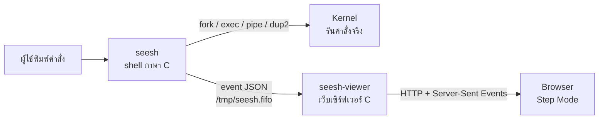

# SeeSh — Design

เอกสารนี้อธิบายโครงสร้างภายในของ SeeSh และ**สัญญากลาง** (โครงสร้างข้อมูลและรูปแบบ event) ที่ทุกส่วนของโปรแกรมใช้ร่วมกัน ต้องแก้ไฟล์นี้ทุกครั้งที่แก้สัญญากลางในโค้ด

## 1. สถาปัตยกรรม



| ส่วน | หน้าที่ |
|---|---|
| `seesh` | รับคำสั่ง รันจริง และเขียน event ของทุก system call สำคัญลง FIFO |
| `seesh-viewer` | อ่าน event จาก FIFO เก็บไว้ในหน่วยความจำ ส่งให้ browser แบบ real-time และให้บริการไฟล์หน้าเว็บ |
| หน้าเว็บ | จัดกลุ่ม event ตามคำสั่ง แล้วแปลงเป็นฉาก (กล่องที่ต้องวาด) และขั้นตอน (เนื้อเรื่อง) |

**หลักสำคัญ:** shell ต้องใช้งานได้ปกติแม้ไม่ได้เปิด viewer หรือปิด viewer กลางคัน

## 2. ลำดับการทำงานของ shell

1. `main.c` พิมพ์ prompt (เฉพาะเมื่อมีคนพิมพ์อยู่หน้าจอ ตรวจด้วย `isatty`) แล้วอ่าน 1 บรรทัด
2. บันทึกลง history แล้ว `parse_line` แยกเป็น `command_t`
3. `execute` เลือกทาง:
   - มี `|` → `run_pipeline`
   - เป็น built-in → ทำในตัว shell (ถ้ามี redirect ให้เปลี่ยน stdin/stdout ชั่วคราวแล้วคืนค่าเดิม)
   - นอกนั้น → `fork` แล้วลูก `exec_simple` (redirect → `execvp`) ส่วนแม่ `waitpid` หรือบันทึกเป็น background job ถ้ามี `&`
4. ก่อนพิมพ์ prompt ทุกครั้ง `jobs_reap` เก็บกวาด background job ที่จบแล้ว

## 3. โครงสร้างคำสั่ง (`src/parser.h`)

```c
#define MAX_ARGS 64
#define MAX_CMDS 16

typedef struct {
    char *argv[MAX_ARGS]; /* argv[0] = ชื่อโปรแกรม, ปิดท้ายด้วย NULL */
    int   argc;
    char *in_file;        /* ไฟล์หลัง <  (NULL = ไม่มี) */
    char *out_file;       /* ไฟล์หลัง > หรือ >> (NULL = ไม่มี) */
    int   append;         /* 1 = >>, 0 = > */
} simple_cmd_t;

typedef struct {
    simple_cmd_t cmds[MAX_CMDS];
    int   ncmds;          /* จำนวนคำสั่งย่อย (1 = ไม่มี pipe) */
    int   background;     /* 1 = ลงท้ายด้วย & */
    char *raw;            /* ข้อความเดิมที่ผู้ใช้พิมพ์ */
} command_t;

int  parse_line(const char *line, command_t *cmd);   /* 0 = สำเร็จ, -1 = syntax error */
void free_command(command_t *cmd);
```

**กติกาของ parser**
- แยก token ตามช่องว่าง และแยก `|`, `<`, `>`, `>>`, `&` ออกเป็น token ของตัวเองแม้ไม่มีช่องว่าง
- ข้อความในเครื่องหมาย `"..."` หรือ `'...'` เป็น token เดียว
- `<` ใช้ได้เฉพาะคำสั่งย่อยตัวแรก และ `>`/`>>` ใช้ได้เฉพาะคำสั่งย่อยตัวสุดท้าย
- `&` ต้องอยู่ท้ายสุด
- คำสั่งย่อยว่าง เช่น `ls |` ถือเป็น syntax error

ตัวอย่าง: `cat < in.txt | sort > out.txt &` ได้ `ncmds = 2`, `cmds[0] = {cat, in_file = "in.txt"}`, `cmds[1] = {sort, out_file = "out.txt"}`, `background = 1`

## 4. ฟังก์ชันของแต่ละโมดูล

| ไฟล์ | ฟังก์ชัน | หน้าที่ |
|---|---|---|
| `executor.h` | `int execute(command_t *cmd)` | จุดเริ่มรันทุกคำสั่ง คืน exit status |
| | `void exec_simple(simple_cmd_t *sc)` | ใช้ในลูกเท่านั้น: redirect แล้ว `execvp` (ไม่คืนค่า) |
| `builtins.h` | `int is_builtin(const char *name)` | ตรวจว่าเป็น built-in ไหม |
| | `int run_builtin(simple_cmd_t *sc)` | รัน built-in |
| `redirect.h` | `int apply_redirect(simple_cmd_t *sc)` | `open` + `dup2` ตาม `<`, `>`, `>>` คืน -1 ถ้าเปิดไฟล์ไม่ได้ |
| `pipeline.h` | `int run_pipeline(command_t *cmd)` | สร้างท่อและลูกทุกตัว แล้วรอทุกตัว |
| `signals.h` | `void signals_init(void)` | ติดตั้ง handler ของ `SIGINT` และ `SIGCHLD` |
| | `void signals_set_prompt(const char *p)` | จำ prompt ให้ handler ของ Ctrl+C พิมพ์ซ้ำ |
| `jobs.h` | `int jobs_add(pid_t pid, const char *raw)` | บันทึก background job |
| | `void jobs_reap(void)` | เก็บกวาด job ที่จบแล้วด้วย `waitpid(WNOHANG)` |
| | `void jobs_print(void)` | คำสั่ง `jobs` |
| `history.h` | `void history_add(const char *line)` | บันทึกคำสั่ง (ล่าสุด 100 คำสั่ง) |
| | `void history_print(void)` | คำสั่ง `history` |
| `events.h` | `void ev_init(void)` | สร้าง FIFO และสั่งให้ไม่สนใจ `SIGPIPE` |
| | `int ev_begin(const char *raw)` | เริ่มคำสั่งใหม่ ส่ง `cmd_start` |
| | `void ev_parse(const command_t *cmd)` | ส่ง `parse` |
| | `void ev_end(int status)` | ส่ง `cmd_end` |
| | `ev_emit(type, owner, syscall, fmt, ...)` | ส่ง event 1 บรรทัด |

## 5. Signal

| Signal | การจัดการ | เหตุผล |
|---|---|---|
| `SIGINT` (Ctrl+C) | handler ขึ้นบรรทัดใหม่ และพิมพ์ prompt ซ้ำถ้ากำลังรอพิมพ์ | shell ไม่ปิด ส่วนลูกได้ค่าปกติคืนอัตโนมัติตอน `exec` จึงยังหยุดด้วย Ctrl+C ได้ |
| `SIGCHLD` | handler ตั้ง flag แล้วให้ `jobs_reap` เก็บกวาดใน main loop | ใน handler ทำงานได้จำกัด จึงทำแค่ตั้ง flag |
| `SIGPIPE` | shell ไม่สนใจ แต่คืนค่าปกติให้ลูกก่อน `exec` | viewer ปิดไปไม่ทำให้ shell ตาย และโปรแกรมอย่าง `yes \| head` ยังจบได้ |

Background job ถูกแยกไปอยู่ process group ของตัวเองด้วย `setpgid` เพื่อไม่ให้ Ctrl+C ไปโดน

## 6. Exit status

| Status | ความหมาย |
|---|---|
| 0 | สำเร็จ |
| 1 | เปิดไฟล์สำหรับ redirect ไม่ได้ |
| 126 | เจอโปรแกรมแต่รันไม่ได้ (เช่น ไม่มีสิทธิ์) |
| 127 | หาโปรแกรมไม่เจอ |

## 7. รูปแบบ Event

### 7.1 การส่ง

- **JSON Lines:** 1 event = 1 บรรทัด ลงท้ายด้วย `\n`
- **ช่องทาง:** FIFO ที่ `/tmp/seesh.fifo` (ทั้ง shell และ server สร้างได้)
- shell เปิด FIFO แบบ `O_WRONLY | O_NONBLOCK` และลองเชื่อมต่อใหม่ทุกคำสั่ง ถ้าไม่มีผู้อ่านก็ข้ามไปเงียบๆ
- fd ของ FIFO ตั้ง `FD_CLOEXEC` โปรแกรมที่ `exec` จึงไม่ได้ fd นี้ไปด้วย
- process ลูกส่ง event ของตัวเองได้ (`open`, `dup2`, `exec`, `exec_fail`) เพราะการเขียนบรรทัดสั้นๆ ลง FIFO เป็น atomic

### 7.2 ฟิลด์

```json
{"cmd":3,"seq":4,"type":"fork","owner":"A","pid":4500,"syscall":"fork()","data":{...}}
```

| ฟิลด์ | ความหมาย |
|---|---|
| `cmd` | เลขคำสั่ง (เริ่มที่ 1 ทุกครั้งที่เปิด shell ใหม่) |
| `seq` | ลำดับภายในคำสั่ง (นับแยกกันในแต่ละ process จึงซ้ำกันได้) |
| `type` | ชนิด event |
| `owner` | กลุ่มของ system call ใช้ระบายสีบนหน้าเว็บ: `A` process, `B` I/O, `C` signal/job |
| `pid` | PID ของ process ที่ส่ง event |
| `syscall` | ชื่อ system call ที่แสดงบนป้าย |
| `data` | ข้อมูลเฉพาะของแต่ละชนิด |

### 7.3 ชนิดของ event

| `type` | owner | ส่งจาก | `data` |
|---|---|---|---|
| `cmd_start` | A | shell | `raw` |
| `parse` | A | shell | `ncmds`, `bg`, `names` |
| `builtin` | A | shell | `name` |
| `pipe` | B | shell | `id`, `read_fd`, `write_fd` |
| `fork` | A | shell | `child`, `name`, `index` |
| `open` | B | ลูก หรือ shell (built-in) | `file`, `mode` (`read` / `write` / `append`) |
| `open_fail` | B | ลูก หรือ shell (built-in) | `file`, `mode`, `errno`, `error` |
| `dup2` | B | ลูก หรือ shell (built-in) | `fd` (`stdin` / `stdout`), `target` (`pipe#N` / `file:<path>` / `terminal`) |
| `exec` | A | ลูก (ก่อนเรียก `execvp`) | `name` |
| `exec_fail` | A | ลูก (หลัง `execvp` ล้มเหลว) | `name`, `errno`, `error` |
| `wait` | A | shell | `child`, `status` |
| `bg_start` | C | shell | `job`, `child` |
| `signal` | C | shell | `sig`, `child` |
| `bg_done` | C | shell | `job`, `status` |
| `cmd_end` | A | shell | `status` |
| `reset` | — | server | — (shell เริ่มใหม่ ให้หน้าเว็บล้างของเก่า) |

`dup2` ที่ `target` เป็น `terminal` หมายถึงการคืนทางออกเดิมหลังรัน built-in ที่มี redirect

### 7.4 ลำดับของ event

แม่กับลูกทำงานพร้อมกัน event จึงอาจมาสลับลำดับ (เช่น `exec` ของลูกมาก่อน `fork` ของแม่) และ event ของ background job (`signal`, `bg_done`) มาหลัง `cmd_end` หน้าเว็บจึง**จัดเรียงตามชนิด** ไม่ใช่ตามลำดับที่มาถึง: parse → pipe → fork → open → dup2 → exec → wait (หรือ bg_start → signal → bg_done)

## 8. Viewer

| Path | ผลลัพธ์ |
|---|---|
| `/` | `viewer/web/index.html` |
| `/<ไฟล์>` | ไฟล์ใน `viewer/web/` (ปฏิเสธ path ที่มี `..`) |
| `/events` | Server-Sent Events: ส่ง event เก่าทั้งหมดก่อน แล้วส่ง event ใหม่ทันทีที่มาถึง |

- ใช้ `poll()` รอ socket, FIFO และ browser ที่เปิดค้างไว้พร้อมกัน ไม่ใช้ thread
- เปิดฝั่งเขียนของ FIFO ค้างไว้เอง เพื่อไม่ให้ได้ EOF ทุกครั้งที่ shell ปิด
- รับเฉพาะการเชื่อมต่อจากเครื่องตัวเอง (`127.0.0.1:8080`)
- เมื่อได้ `cmd_start` ของคำสั่งที่ 1 แปลว่า shell เริ่มใหม่ จะล้าง event เก่าและส่ง `reset`
- เก็บ event สูงสุด 5000 ตัว

## 9. กติกาการแก้สัญญากลาง

1. แก้ `parser.h` หรือรูปแบบ event ต้องแก้ไฟล์นี้ใน commit เดียวกัน
2. เพิ่มฟิลด์หรือ event ชนิดใหม่ได้ แต่ห้ามลบหรือเปลี่ยนความหมายของของเดิม
3. เพิ่ม event ชนิดใหม่ต้องเพิ่มคำอธิบายใน `viewer/web/narration.js` ด้วย