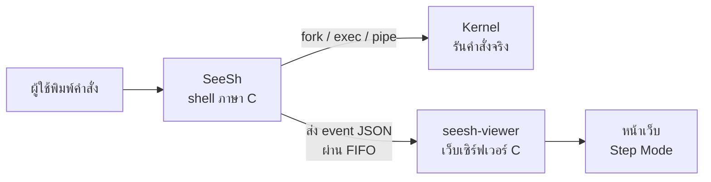

# SeeSh: See-Through Shell for Visualizing System Calls

**SeeSh: เชลล์โปร่งใสสำหรับแสดงการทำงานของ System Call**

รายวิชา Operating Systems and System Calls Programming · Mini Project

---

## 1. โปรเจกต์นี้ทำอะไร

SeeSh คือ shell ที่เราเขียนขึ้นเองด้วยภาษา C โดยใช้ POSIX system calls จริง ใช้งานได้เหมือน shell ทั่วไป เช่น รันโปรแกรม, redirect, pipe และ background job

สิ่งที่ต่างจาก shell ทั่วไปคือ **ทุกคำสั่งที่รัน SeeSh จะส่งข้อมูลว่าตัวเองเรียก system call อะไรบ้าง** ไปแสดงบนหน้าเว็บ ซึ่งอธิบายการทำงานทีละขั้นด้วยภาษาที่เข้าใจง่าย (Step Mode) เช่น "สร้างผู้ช่วย 3 คน" หรือ "ต่อท่อส่งข้อมูล" โดยมีชื่อ system call กำกับไว้

## 2. มีประโยชน์อย่างไร

- **ช่วยให้เข้าใจ OS ได้เห็นภาพ:** ปกติเรามองไม่เห็นว่าเบื้องหลังคำสั่งอย่าง `ls | wc -l` เกิดอะไรขึ้น SeeSh แสดงให้เห็นทีละขั้นจากการทำงานจริง ไม่ใช่การจำลอง
- **อธิบายข้อผิดพลาดได้:** บอกได้ว่าคำสั่งล้มเหลวที่ขั้นไหนและเพราะอะไร เช่น หาโปรแกรมไม่เจอ หรือเปิดไฟล์ไม่ได้
- **ใช้เป็นสื่อการสอนได้:** ผู้ไม่มีพื้นฐานก็อ่านตามเข้าใจ
- **อ่านโค้ดเข้าใจได้ทั้งหมด:** ต่างจาก bash ที่มีโค้ดขนาดใหญ่เกินกว่าจะใช้ศึกษา

## 3. ได้เรียนรู้อะไร

| เรื่อง | ได้เรียนรู้จาก |
|---|---|
| Process management | การสร้างและรอ process ด้วย `fork`, `execvp`, `waitpid` และการป้องกัน zombie |
| IPC | การต่อโปรแกรมด้วย `pipe` และการส่งข้อมูลระหว่าง shell กับเว็บด้วย FIFO และ socket |
| File I/O | การเปลี่ยนทางเข้า-ออกของข้อมูลด้วย `open`, `dup`, `dup2` |
| Signals | การจัดการ `SIGINT`, `SIGCHLD`, `SIGPIPE` และ process group |
| การทำงานเป็นทีม | การใช้ GitHub และทดสอบข้ามระบบปฏิบัติการ (macOS, Linux, Windows/WSL) |

## 4. ขอบเขต

**ทำ**
- รันโปรแกรมภายนอก และ built-in: `cd`, `pwd`, `jobs`, `history`, `help`, `exit`
- Redirection (`<`, `>`, `>>`) ทั้งกับโปรแกรมภายนอกและ built-in
- Pipe หลายขั้น และใช้ร่วมกับ redirect
- Background job (`&`), Ctrl+C ไม่ปิด shell และไม่มี zombie process
- หน้าเว็บ Step Mode: เลือกคำสั่ง แล้วดูทีละขั้นหรือเล่นอัตโนมัติ พร้อมอธิบายข้อผิดพลาด

**ไม่ทำ**
- Scripting (`if`, `for`), ตัวแปร (`$VAR`), wildcard (`*.c`)
- `&&`, `||`, `;`, `fg`, `!!` และ background pipeline
- ปุ่มลูกศรแก้ไขคำสั่ง และ auto-complete

## 5. โครงสร้าง

- **Shell แยกจากหน้าเว็บ:** shell คืองานหลักของวิชา ต้องใช้งานได้ปกติแม้ไม่ได้เปิดหน้าเว็บ
- **สื่อสารผ่าน FIFO:** shell แค่เขียนข้อความลง FIFO แล้วทำงานต่อ และ FIFO เองก็เป็นเนื้อหา IPC ของวิชา
- **มีเว็บเซิร์ฟเวอร์คั่นกลาง:** browser อ่าน FIFO โดยตรงไม่ได้ จึงต้องมีตัวกลาง เขียนด้วย C เพื่อใช้ system call กลุ่ม socket ด้วย

โครงสร้างไฟล์อยู่ใน [README.md](../README.md) และรายละเอียดการออกแบบอยู่ใน [design.md](design.md)

## 6. การแบ่งหน้าที่

| งาน | ผู้รับผิดชอบ |
|---|---|
| เขียนโค้ดทั้งหมด | ทุกคน |
| ทดสอบบน Windows (WSL) | พัทธดนย์ คำนัน, ณัฐภัทร ฉ่ำตะคุ |
| Final report, สไลด์, ซ้อม demo | ทุกคน |
| **ทำความเข้าใจทุกส่วนของโปรเจกต์ให้อธิบายได้** | ทุกคน |

## 7. แผนการทดสอบ

**วิธีทดสอบ**
1. **ทดสอบอัตโนมัติ:** `make test` ป้อนคำสั่งชุดเดียวกันเข้าทั้ง SeeSh และ bash แล้วเทียบผล 32 กรณี แต่ละข้อรันในโฟลเดอร์ชั่วคราว และถ้าค้างเกิน 5 วินาทีนับว่าไม่ผ่าน
2. **ทดสอบด้วยมือ:** Ctrl+C และการแสดงผลบนหน้าเว็บ
3. **ทดสอบข้ามเครื่อง:** macOS, Linux (Codespaces) และ Windows (WSL)

| ชุดทดสอบ | ครอบคลุม | จำนวน |
|---|---|---|
| `tests/test_core.sh` | รันโปรแกรม, built-in, ข้อผิดพลาด, history | 13 |
| `tests/test_io.sh` | redirect, pipe หลายขั้น, built-in + redirect, ข้อมูลเยอะผ่านท่อ | 14 |
| `tests/test_signals.sh` | background job, jobs, Done, ไม่มี zombie | 5 |

**ทดสอบด้วยมือ**

| ทดสอบ | ผลที่คาดหวัง |
|---|---|
| `sleep 30` แล้วกด Ctrl+C | `sleep` หยุด shell ยังอยู่ และขึ้น prompt ครั้งเดียว |
| กด Ctrl+C ที่ prompt | ขึ้น prompt ใหม่ทันที |
| ปิดหน้าเว็บหรือ viewer แล้วใช้ shell ต่อ | shell ทำงานปกติ ไม่ค้าง ไม่ตาย |
| รันคำสั่งตัวอย่างใน README | หน้าเว็บแสดงขั้นตอนครบ เรียงถูกต้อง และอธิบายข้อผิดพลาดได้ |

## 8. นิยามคำว่าเสร็จ

**1. Shell ทำงานได้ครบ**
- [x] รันโปรแกรมภายนอก + แจ้งเมื่อหาไม่เจอ
- [x] Built-in: `cd`, `pwd`, `exit`, `help`, `jobs`, `history`
- [x] Redirect ใช้ได้ทั้งโปรแกรมภายนอกและ built-in
- [x] Pipe หลายขั้น + ใช้ร่วมกับ redirect
- [x] Background job + `jobs`
- [x] Ctrl+C ไม่ปิด shell และพิมพ์ prompt ใหม่
- [x] ไม่มี zombie
- [x] Syntax error ไม่ทำให้ shell ปิด

**2. Visualizer แสดงผลถูกต้อง**
- [x] ทุกคำสั่งแสดงทีละขั้น และเนื้อเรื่องตรงกับความจริง
- [x] อธิบายเหตุผลกรณีผิดพลาด
- [x] อัปเดตทันที, refresh ไม่หาย, เริ่มใหม่แล้วล้าง
- [x] Shell ใช้ได้แม้ไม่เปิดหรือปิด viewer กลางคัน

**3. คุณภาพโค้ด**
- [x] Build ไม่มี warning ทั้ง macOS และ Linux
- [x] `make test` ผ่านทั้ง macOS และ Linux
- [x] ทดสอบด้วยมือผ่าน

**4. ใช้งานได้บน Windows**
- [ ] เพื่อนทั้ง 2 คน clone, build และรันได้บน WSL
- [ ] Browser บน Windows เปิดหน้าเว็บได้และเห็นคำสั่งแบบ real-time
- [ ] `make test` ผ่านบน WSL

**5. เอกสาร**
- [x] `README.md`
- [x] `docs/design.md`
- [x] `docs/plan.md`
- [x] Comment ในโค้ด

**6. ส่งงานตาม Syllabus**
- [ ] Final report: สถาปัตยกรรม, system call ที่ใช้, features, ผลการทดสอบ, ปัญหาที่เจอและวิธีแก้
- [ ] สไลด์นำเสนอ
- [ ] ทุกคนอธิบายได้ทุกส่วนของโปรเจกต์ และ demo คนเดียวได้
- [ ] ซ้อม demo บนเครื่องที่จะใช้จริงอย่างน้อย 2 รอบ